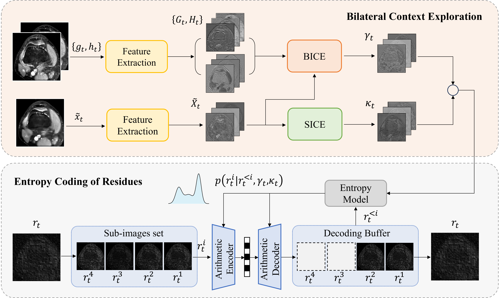

Source code for our work "Bilateral Context Modeling for Residual Coding in Lossless 3D Medical Image Compression"



---

# Preparation

## Download Data and Pretrained Models

### Download Test Dataset
1. Download MRNet test dataset from [MRNet](https://stanfordmlgroup.github.io/competitions/mrnet/).
2. Download MosMedData test dataset from [Kaggle](https://www.kaggle.com/datasets/andrewmvd/mosmed-covid19-ct-scans?select=CT-3).
3. Download TRABIT test dataset from [Kaggle](https://www.kaggle.com/competitions/trabit2019-imaging-biomarkers/data).
4. Move the dataset to `{Data_Path}`, where `{Data_Path}` is the directory to store data. The directory should be organized like:
```
{Data_Path}
   - MRNet-v1.0
      - valid
         - axial
            - 1130.npy
            - ...
         - coronal
            - 1130.npy
            - ...
         - sagittal
            - 1130.npy
            - ...
   - Mosmed_COVID-19_CT
      - CT-3
         - study_1064.nii
         - ...
   - TRABIT
      - test
         - mri_00539274.nii
         - ...
```

### Download Pretrained Models
Download pre-trained models from [Google Driver](https://drive.google.com/drive/folders/1Ogi8ZKouMTsHS59nr_xdu1wQIEGhFbuB?usp=sharing).

## Install Docker and NVIDIA-Container-Toolkit on Ubuntu
You can refer to the following documents to install Docker and NVIDIA-Container-Toolkit on Ubuntu.
1. [Install Docker](https://docs.docker.com/engine/install/ubuntu/#set-up-the-repository)
2. [Install NVIDIA-Container-Toolkit](https://docs.nvidia.com/datacenter/cloud-native/container-toolkit/install-guide.html#install-guide)

## Run Docker Container
1. go to the project directory.
2. create a docker image.
    ```shell
    docker build -t BCM-Net .
    ```
3. create a docker container and run it.
    ```
    docker run -it --name="BCM-Net" --gpus all --runtime=nvidia \
     -v {Code_Path}:/home/Code 
     -v {Models_Path}:/home/Models
     -v {Data_Path}:/home/Data \
     -v {Experiment_Path}:/home/Experiment \
     medical:latest
    ```
   - `{Code_Path}` denotes the project directory path
   - `{Models_Path}` denotes the model directory path
   - `{Data_Path}` denotes the data directory path
   - `{Experiment_Path}` denotes the experimental directory path to save results

## Compile traditional video codec VTM-15.0

> The following commands should be executed in the Docker container.

1. go to the VTM folder.
   ```shell
   cd /home/VVCSoftware_VTM
   ```
2. compile VTM codec which supports 8/10bit input.
   ```shell
   mkdir build && cd build && cmake .. -DCMAKE_BUILD_TYPE=Release && make -j
   ```
3. rename the compiled codec.
   ```shell
   mv ../bin/EncoderAppStatic /home/VVC_Encoder_8bit && mv ../bin/DecoderAppStatic /home/VVC_Decoder_8bit
   ```
4. set the macro `JVET_R0351_HIGH_BIT_DEPTH_ENABLED` to `1` to support 16-bit input.
   ```shell
   nano ./source/Lib/CommonLib/TypeDef.h
   # then change line 84 and save the file
   ```
5. compile VTM codec which supports 16bit input.
   ```shell
   make clean && cmake .. -DCMAKE_BUILD_TYPE=Release && make -j
6. rename the compiled codec.
   ```shell
   mv ../bin/EncoderAppStatic /home/VVC_Encoder_16bit && mv ../bin/DecoderAppStatic /home//VVC_Decoder_16bit
   ```
  
# Test Our Method

> The following commands should be executed in the Docker container.

:bug: Please modify the torch source file according to this [PR](https://github.com/pytorch/pytorch/pull/99980/commits/222b25601ba54ebbe17a8597d37bad56e7b0b5ec) before the test.

## Test on MRNet

### Test on the axial subset
```shell
cd /home/Code && python3 TestMRNet.py --mr_net_root /home/Data/MRNet-v1.0/valid/axial --save_directory /home/Experiment/TestAxial \
                                      --lossy_encoder_path /home/VVC_Encoder_8bit \
                                      --lossy_decoder_path /home/VVC_Decoder_8bit \
                                      --lossy_cfg_path /home/VVCSoftware_VTM/cfg/encoder_randomaccess_vtm_gop16.cfg /home/VVCSoftware_VTM/cfg/per-class/classSCC.cfg \
                                      --qp 37 --checkpoints /home/Models/MRNet/Axial.pth --gpu
```
### Test on the coronal subset
```shell
cd /home/Code && python3 TestMRNet.py --mr_net_root /home/Data/MRNet-v1.0/valid/coronal --save_directory /home/Experiment/TestCoronal \
                                      --lossy_encoder_path /home/VVC_Encoder_8bit \
                                      --lossy_decoder_path /home/VVC_Decoder_8bit \
                                      --lossy_cfg_path /home/VVCSoftware_VTM/cfg/encoder_randomaccess_vtm_gop16.cfg /home/VVCSoftware_VTM/cfg/per-class/classSCC.cfg \
                                      --qp 37 --checkpoints /home/Models/MRNet/Coronal.pth --gpu
```

### Test on the sagittal subset
```shell
cd /home/Code && python3 TestMRNet.py --mr_net_root /home/Data/MRNet-v1.0/valid/sagittal --save_directory /home/Experiment/TestSagittal \
                                      --lossy_encoder_path /home/VVC_Encoder_8bit \
                                      --lossy_decoder_path /home/VVC_Decoder_8bit \
                                      --lossy_cfg_path /home/VVCSoftware_VTM/cfg/encoder_randomaccess_vtm_gop16.cfg /home/VVCSoftware_VTM/cfg/per-class/classSCC.cfg \
                                      --qp 37 --checkpoints /home/Models/MRNet/Sagittal.pth --gpu                 
```

## Test on MosMedData
```shell
cd /home/Code && python3 TestMosMedData.py --mosmed_root /home/Data/Mosmed_COVID-19_CT/CT-3 --save_directory /home/Experiment/TestMosMedData \
                                      --lossy_encoder_path /home/VVC_Encoder_16bit \
                                      --lossy_decoder_path /home/VVC_Decoder_16bit \
                                      --lossy_cfg_path /home/VVCSoftware_VTM/cfg/encoder_randomaccess_vtm_gop16.cfg /home/VVCSoftware_VTM/cfg/per-class/classSCC.cfg \
                                      --qp 17 --checkpoints /home/Models/MosMedData/MosMedData.pth --gpu \
                                      --bit_depth 16                       
```

## Test on TRABIT
```shell
cd /home/Code && python3 TestTRABIT.py --trabit_root /home/Data/TRABIT2019_MRI/test --save_directory /home/Experiment/TestTRABIT \
                                      --lossy_encoder_path /home/VVC_Encoder_16bit \
                                      --lossy_decoder_path /home/VVC_Decoder_16bit \
                                      --lossy_cfg_path /home/VVCSoftware_VTM/cfg/encoder_randomaccess_vtm_gop16.cfg /home/VVCSoftware_VTM/cfg/per-class/classSCC.cfg \
                                      --qp 0 --checkpoints /home/Models/TRABIT/TRABIT.pth --gpu \
                                      --bit_depth 16
```


# Acknowledgment
:heart::heart::heart: This work is implemented based on the following projects. We really appreciate their wonderful open-source work!
- [torchac](https://github.com/fab-jul/torchac)
- [L3C](https://github.com/fab-jul/L3C-PyTorch)
